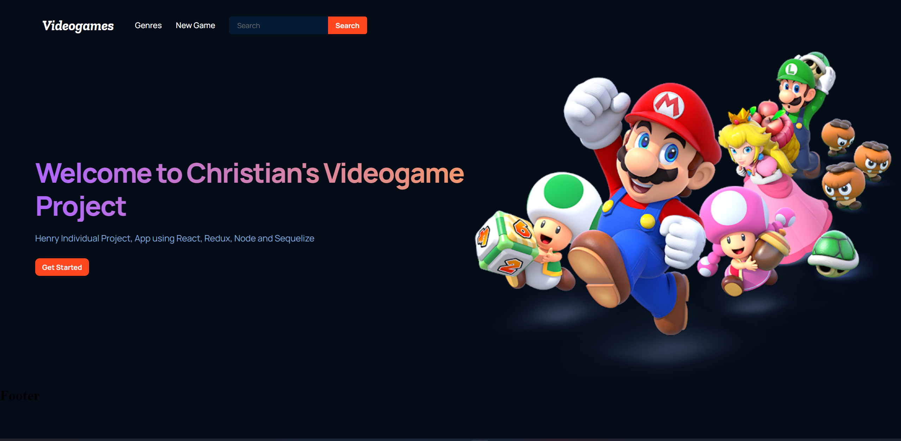

### Hi there 👋

- 𝗜 𝗮𝗺 𝗮 web developer
- 𝗜 am junnior level

```js
import React, {useState} from 'react'

const ChristianCastellanos = () => {
  const [christian, setChristian] = useState({
    pronouns: ["He", "Him"],
    technologies: ["JavaScript", "React", "Redux", "Node.js", "Express", "Sequileze", "PostgresSQL"],
    hobbies: ["Learning", "Coding", "Biking", "Hiking"], 
    funFact: "AI support in React!"
  })
  return (
     <div>
        <h1>About me<h1/>
        <div className='about'>
          <label>Pronouns<label/>
          <p>{christian.pronouns}</p>
          
          <label>Technologies<label/>
          <p>{christian.technologies}</p>
          
          <label>Hobbies<label/>
          <p>{christian.hobbies}</p>
        <div/>
     <div/>
  )
}
```
## 𝗪𝗵𝗮𝘁 𝗜 𝗨𝘀𝗲

<table>
  <tbody>
    <tr valign="top">
      <td width="25%" align="center">
        <span>JavaScript</span><br><br><br>
        
      </td>
      <td width="25%" align="center">
        <span>React js</span><br><br><br>
        
      </td>
      <td width="25%" align="center">
        <span>Redux</span><br><br><br>
        
      </td>
      <td width="25%" align="center">
        <span>Node js</span><br><br><br>
        
      </td>
    </tr>
    <tr valign="top">
      <td width="25%" align="center">
        <span>Express</span><br><br><br>
        
      </td>
      <td width="25%" align="center">
        <span>Sequelize js</span><br><br><br>
        
      </td>
      <td width="25%" align="center">
        <span>PostgresSQL</span><br><br><br>
        
      </td>
      <td width="25%" align="center">
        <span>Git</span><br><br><br>
       
      </td>
    </tr>
  </tbody>
</table>

# 𝗖𝘂𝗿𝗿𝗲𝗻𝘁𝗹𝘆 𝘄𝗼𝗿𝗸𝗶𝗻𝗴 𝗼𝗻

- 💻 [PF e-Commerce Front-end I'm Henry Bootcamp](https://github.com/NicoRob92/FrontEcommerce)
- 💻 [PF e-Commerce Back-end I'm Henry Bootcamp](https://github.com/Roystreet/PF_SERVICIOS)

# Check one of my projects
[Videogame Page](https://github.com/c4chris124/PI-Videogames-main)



# 𝗠𝘆 𝗦𝘁𝗮𝘁𝘀


